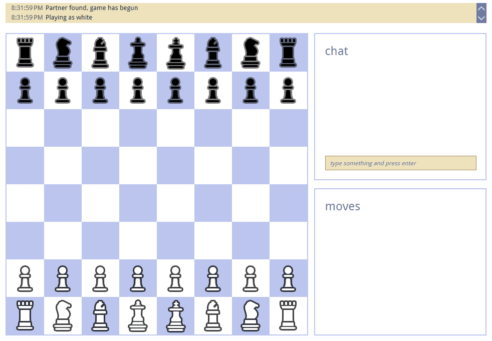

Jeu d'Échecs en Ligne

Un jeu d'échecs en ligne réalisé avec NodeJS et Websockets (socket.io).

Description
Cette application permet à deux joueurs de s'affronter en temps réel tout en ayant la possibilité de discuter via un chat intégré.

Instructions d'Exécution
Pour exécuter l'application, suivez ces étapes :
Installez les dépendances : npm install
Lancez le serveur Node.js : node server.js
Accédez à l'application via votre navigateur à l'adresse suivante : localhost:5000.

Déploiement
Cette application est conçue pour être conteneurisée et déployée à l'aide d'une pipeline CI/CD sur une VM Azure.